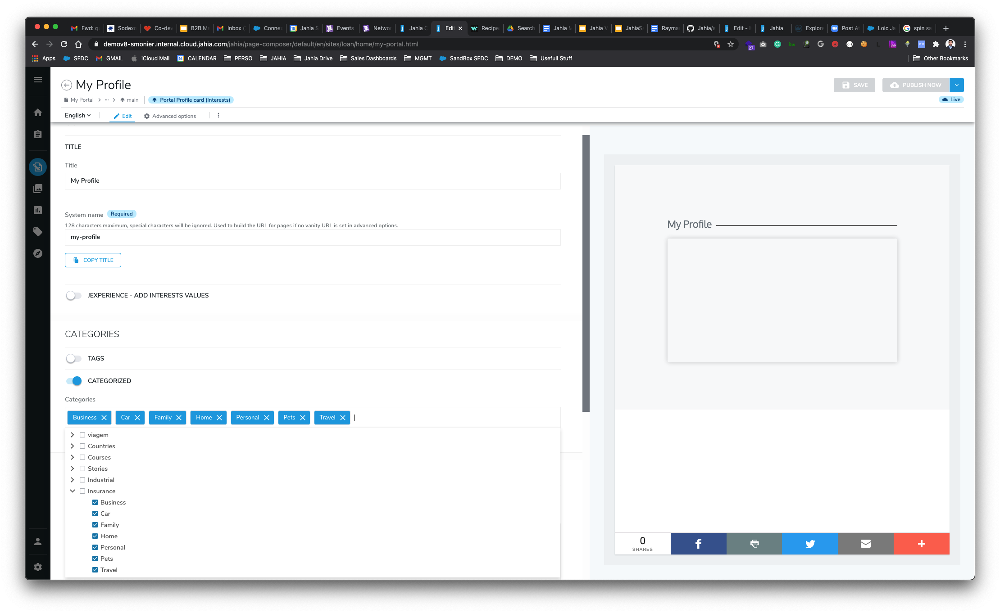
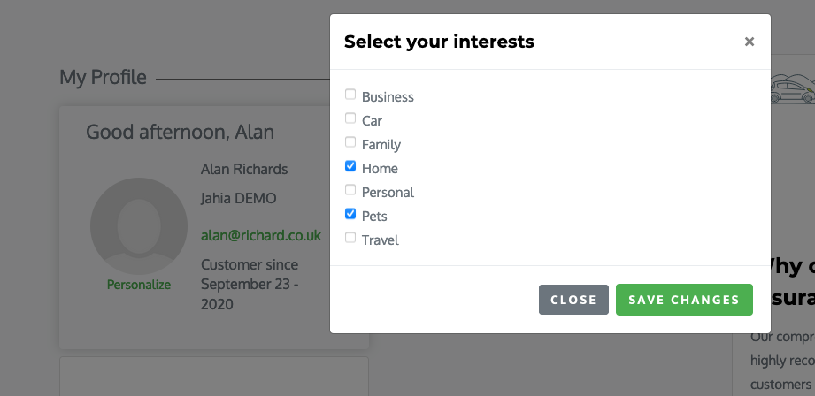

# UNOMI Profile Card

## Jahia 8 module

Display a Profile card with information coming from the Customer Data Platform UNOMI (http://unomi.apache.org)

The end-user can also select interest based on selected catagories, those preferences will be stored as profile properties (PortalInterest) in Unomi.

## Installation

Download the code source on github, recompile the module locally, and deploy the module through your Jahia Modules administration panel

```bash
mvn clean install
```
### screenshots





